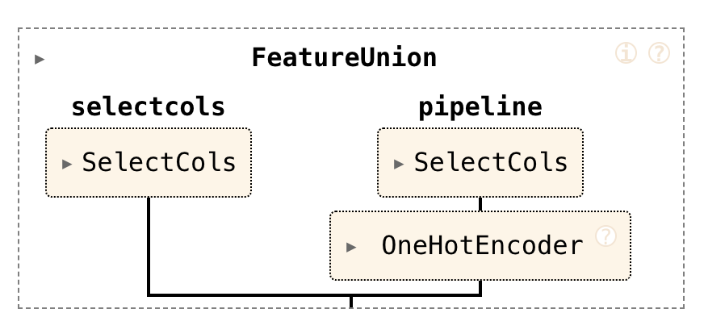

# scikit-play

> Rethinking machine learning pipelines a bit.

## What does `scikit-play` do?

I was wondering if there might be an easier way to construct scikit-learn pipelines. Don't get me wrong, scikit-learn is amazing when you want elaborate pipelines ([exhibit A](https://www.youtube.com/watch?v=7TZ7j4HSzmE), [exhibit B](https://www.youtube.com/watch?v=lhMqqauXtW0)) but maybe there is also a place for something more lightweight and playful. This library is all about exploring that.

Imagine that you are dealing with the titanic dataset.

```python
import pandas as pd

df = pd.read_csv("https://calmcode.io/static/data/titanic.csv")
df.head()
```

Here's what the dataset looks like.

|   survived |   pclass | name                                                | sex    |   age |    fare |   sibsp |   parch |
|-----------:|---------:|:----------------------------------------------------|:-------|------:|--------:|--------:|--------:|
|          0 |        3 | Braund, Mr. Owen Harris                             | male   |    22 |  7.25   |       1 |       0 |
|          1 |        1 | Cumings, Mrs. John Bradley (Florence Briggs Thayer) | female |    38 | 71.2833 |       1 |       0 |
|          1 |        3 | Heikkinen, Miss. Laina                              | female |    26 |  7.925  |       0 |       0 |
|          1 |        1 | Futrelle, Mrs. Jacques Heath (Lily May Peel)        | female |    35 | 53.1    |       1 |       0 |
|          0 |        3 | Allen, Mr. William Henry                            | male   |    35 |  8.05   |       0 |       0 |

The goal of this dataset is to predict who survived, so **survived** is the target column for a classification task. But in order to make the right predictions you would need to encode the features in the right way. So to do that, you might construct a preprocessing pipeline like this:

```python
from sklearn.pipeline import make_union, make_pipeline
from sklearn.preprocessing import OneHotEncoder
from skrub import SelectCols

pipe = make_union(
    SelectCols(["age", "fare", "sibsp", "parch"]),
    make_pipeline(
        SelectCols(["sex", "pclass"]),
        OneHotEncoder()
    )
)
```

This pipeline takes the **age**, **fare**, **sibsp** and **parch** features as-is. These features are already numeric so these do not need to be changed. But the **sex** and **pclass** features are candidates to one-hot encode first. These are categorical features, so it helps to encode them as such.

The pipeline works, and it's fine, but you could wonder if this is *easy*. After all, you do need to know scikit-learn fairly well in order to build a pipeline this way and you may also need to appreciate Python. There's some nesting happening in here as well, so for a novice or somebody who just immediately wants to make a quick model ... there's some stuff that gets in the way. All of this is fine when you consider that scikit-learn needs to allow for elaborate pipelines ... but if you just want something dead simple ... then you may appreciate another syntax instead.

## Enter skplay.

Skplay offers an API that allows you to declare the aforementioned pipeline by doing this instead:

```python
from skplay import feats, onehot

formula = feats("age", "fare", "sibsp", "parch") + onehot("sex", "pclass")
```

This `formula` object is just an object that can accumulate components.

```python
# This object is a scikit-learn pipeline but with operator support!
formula
```



It's pretty much the same pipeline as before, but it's a lot easier to go ahead and declare. You're mostly dealing with column names and how to encode them, instead of thinking about how scikit-learn constructs a pipeline.

This is what `scikit-play` is all about, but this is just the start of what it can do. If that sounds interest you can read more on the [documentation page](https://koaning.github.io/scikit-play/).

Alternative you may also explore this tool by installing it via:

```
python -m pip install scikit-play
```

## Thanks

This project was originally part of my work over at [calmcode labs](https://calmcode.io/labs/drawdata) but my employer [probabl](https://probabl.ai) has
been very supportive and has allowed me to work on this project during
my working hours. This was super cool and I wanted to make sure I recognise them for it.

<p align="center" width="100%" dir="auto">
    <a href="https://calmcode.io">
        
    </a>
    <a href="https://probabl.ai">
        
    </a>
    <br><br><br>
</p>

<br>
